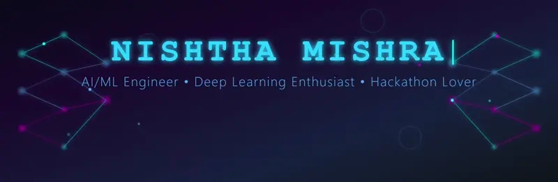

#  **Hey there, I'm Nishtha!**

  

---

🎓 Third-year B.Tech CSE student @ KIIT University  
🤖 AI/ML Enthusiast | Hackathon Winner | AI Intern @ Infosys  
💡 Passionate about Deep Learning, NLP, and Computer Vision

---

## 🚀 About Me
- 🔭 **Currently:** Working on AI-powered ML projects at **KIIT Robotics Society**
- 🌱 **Learning:** Advanced Deep Learning architectures & MLOps
- 💼 **Experience:** AI Intern @ Infosys
- ⚡ **Passion:** I absolutely love hackathons! The adrenaline rush of building something impactful in just a few days keeps me going

### 🏆 Hackathon Achievements
- 🥈 **2nd Place** - BIS-NEXUS Hackathon (Healthcare AI)
- 👩‍💻 **Top 50 Female Coders** - Amazon HackOn Season 5
- 🤖 **Built Smart Chatbot with LLMs** @ Kshitij IIT-KGP

---

🛠️ Technical Arsenal
Languages

  
  
  
  

Machine Learning & Deep Learning

  
  
  
  

Specializations: CNNs, RNNs, Transformers | NLP (Text Preprocessing, Embeddings) | Classical ML (Regression, SVM, KNN)
Data Science & Visualization

  
  
  
  

Computer Vision & Media Processing

  
  

Development Tools & Platforms

  
  
  
  
  

Web Frameworks

  
  

## 📂 Featured Projects

| Project | Description | Technologies | Links |
|---------|-------------|--------------|--------|
| **Carbon Compass** 🌍 | AI system to predict & monitor carbon emissions using geospatial data | Python, TensorFlow, Geospatial Analysis | [Live Demo](https://carbonescompass.netlify.app/) |
| **ThermoNyx** 🔥 | Thermal anomaly detection for drone images (MIT AI Hackathon) | Python, OpenCV, Computer Vision | [GitHub](https://github.com/Rinav01/ThermoNyx) |

---

## ML Easter Eggs

**Click to reveal some wild AI truths!** 👇

🤯 The "73 cents" bug that almost killed a company

In 2012, Knight Capital's trading algorithm had a bug that caused it to buy high and sell low repeatedly. **In 45 minutes**, it lost **$440 million**. The company's stock dropped 73 cents... oh wait, I mean 73%. One. Buggy. Loop. 💸

**Lesson:** Always test your models in production-like environments!

🎨 GANs were invented because of an argument at a bar

Ian Goodfellow invented GANs in 2014 after a heated debate with friends at a bar about generative models. He went home, coded it up the same night, and it worked on the first try. **Beer-driven innovation** at its finest! 🍺🤖

**Fun fact:** He didn't even debug it. First run = success. We're all jealous.

🧠 GPT-3 has 175 billion parameters...

To put that in perspective:
- If each parameter were a grain of sand, you'd fill **3.5 Olympic swimming pools**
- If you counted one parameter per second, it would take **5,500+ years**
- The model file is **350GB+** (good luck fitting that on your laptop!)

And GPT-4? Even bigger. Nobody knows exactly how big (OpenAI keeps secrets 🤫)

🔮 Neural networks are older than you think

The **perceptron** was invented in **1958**! That's 66+ years ago! We've been trying to make computers think like brains since before the internet existed. 

**Plot twist:** The first neural network was implemented in **hardware**, not software. Imagine debugging that with no Stack Overflow! 😅

⚡ Why training models takes forever

A single **matrix multiplication** in a transformer might involve multiplying two **12,000 × 12,000** matrices. That's **1.7 BILLION** individual operations. 

And you do this **thousands of times** per batch. Per epoch. For **hundreds of epochs**. 

**Total operations?** Quintillions. Yes, that's a real number. 🤯

**No wonder** your GPU sounds like a jet engine!

---

## 🌐 Let's Connect

  
  
  

---

