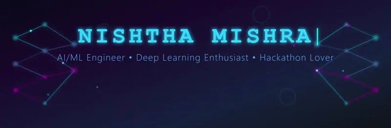

#  **Hey there, I'm Nishtha!**

  

---

🎓 **B.Tech in Computer Science & Communication Engineering** @ KIIT University (2023 – 2027)  
🤖 **AI & Backend Engineer** | Specialist in Agentic AI, Multi-Agent Systems & Distributed Infrastructure  
💡 **Focus:** Building scalable, fault-tolerant systems and high-performance ML pipelines.

---

## 🚀 About Me
- 🔭 **Currently:** Deep-diving into **System Design** and **Agentic Workflows** (LangGraph, Multi-Agent loops).
- 🌱 **Expertise:** Architecting distributed stores (Consistent Hashing, Quorum logic) and optimizing LLM/VLM inference.
- 💼 **Experience:** Ex-AI/Backend Intern @ **Aether AI** | AI/ML Lead @ **CyberVault KIIT**.
- ⚡ **Passion:** Optimizing the "un-optimizable"—whether it's an AST-based SQL optimizer or a 50K+ ops/sec KV store.

### 🏆 Milestone Achievements
- 🥇 **Hackathon Winner** - TechZephyr 3.0 Machine Learning Hackathon (IIT Bhubaneswar).
- 🥈 **2nd Place** - BIS-NEXUS Healthcare Hackathon.
- 👩‍💻 **Top 50 Female Coders** - Amazon HackOn Season 5 (Out of 10,000+ participants).
- 🎓 **Mentorship** - Mentored **70+ students** in ML and conducted technical recruitment for KIIT Robotics Society.

---

## 🛠️ Technical Arsenal

### **Backend & Distributed Systems**

  
  
  
  

> **Core Competencies:** Consistent Hashing, Vector Clocks, Quorum R+W, System Design, REST APIs, WAL.

### **AI / Machine Learning / NLP**

  
  
  
  

> **Specializations:** Agentic AI (LangGraph), Multi-Agent Systems, LLM/VLM/OCR Pipelines, NLU Chatbots.

---

## 📂 Featured Projects

| Project | Description | Stack | Links |
| :--- | :--- | :--- | :--- |
| **MiniKV** 🗄️ | Distributed KV store with **5-node cluster**, consistent hashing (150 virtual nodes), and **50K+ ops/sec**. | Python, Redis, Docker | [GitHub](https://github.com/nishb2715) |
| **DistrQ** ⚡ | Distributed Task Queue handling **10K+ concurrent jobs** with zero task loss and PostgreSQL state machine. | FastAPI, Redis, SQL | [GitHub](https://github.com/nishb2715) |
| **QueryForge** 🔍 | AST-based SQL Optimizer reducing query planning complexity to **O(n log n)**. | Python, PostgreSQL | [GitHub](https://github.com/nishb2715) |

---

## 🧠 System Design "Easter Eggs"

⚖️ Why 150 Virtual Nodes?

In distributed systems like my <b>MiniKV</b> project, virtual nodes ensure that if one server goes down, the load is redistributed evenly across the cluster rather than overwhelming a single neighbor. It's the difference between a minor hiccup and a total system collapse.

🔄 Quorum Logic: R + W > N

To ensure strict consistency in a distributed system, you need the number of nodes you read from (R) plus the number you write to (W) to be greater than the total nodes (N). If you don't? You're basically gambling with your data's "truth." 🎲

🛠️ The "Agentic" Shift

Moving from simple LLM prompts to <b>LangGraph</b> loops allows AI to "think, act, and correct." At Aether AI, this shift improved query resolution by <b>30%</b>. Agents aren't just chatbots anymore; they're autonomous coworkers.

---

## 🌐 Let's Connect

  
  
  

---

